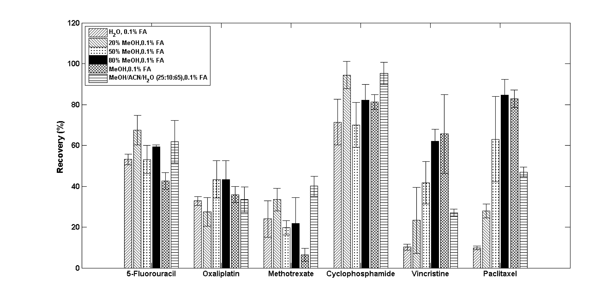

__Abstract__: An effective wipe sampling and LC–MS/MS method was developed to simultaneously analyze six commonly administered antineoplastic drugs in stainless steel surface. The analyzed drugs were methotrexate, paclitaxel, cyclophosphamide, 5-fluorouracil, vincristine, and oxaliplatin, a frequently prepared antineoplastic drug that has not been included among any of the published simultaneous detection methods. The established method was used to evaluate the recoveries of antineoplastic drugs on brand new and worn stainless steel surfaces by wiping the plates with a Whatman filter paper wetted with 0.5 mL of water/methanol (20:80) with 0.1%formic acid followedbyLC–MS/MS before desorbing the filter with a water/methanol (50:50) solution. A significant decrease in the recovery of all evaluated drugs was found when worn plates were used. Additionally, the inter-personnel variability on drug recoveries during wiping procedures was evaluated. Significantly higher recoveries were achieved by the personnel with more training and experience versus personnel without prior experience. Finally, a laboratory stability test was developed to assess the degradation of the antineoplastic drugs during replicated shipping conditions. With the exception of vincristine sulfate which exhibited a significant (p<0.05) degradation after 48 h, all evaluated drugs were stable during the first 24–48 h. However, after 144 h, an increase in the degradation of all evaluated drugs was observed, with oxaliplatin and 5- fluorouracil exhibiting the most degradation.
