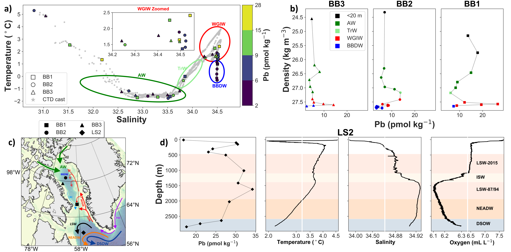

__Abstract__: This study addresses an important knowledge gap in the distribution of lead (Pb) in the Arctic Ocean, by presenting dissolved Pb concentrations from samples collected during the GEOTRACES Canadian cruise in 2015. Dissolved Pb showed an increase in concentration from the Canada Basin toward Baffin Bay and the Labrador Sea. Canada Basin was the most isolated region from anthropogenic Pb inputs with low background concentrations (1.4−6.2 pmol kg−1) across most of the basin, although higher Pb features from the advection of Pacific-derived waters and sea ice meltwater were present. Likewise, high-Pb peaks (13.5−26.6 pmol kg−1) along narrow isopycnal surfaces (σθ, 27.4−27.6) in Baffin Bay were attributed to the advection of North Atlantic waters spreading a high-Pb signature into the bay, contrasting with the low values (2.5−7.4 pmol kg−1) present in the mixed layer, Arctic and Baffin Bay deep waters. The Labrador Sea, largely influenced by the recirculation of North Atlantic waters, had the highest Pb concentrations (∼17−34 pmol kg−1) measured in this study. The Canadian Arctic Archipelago (CAA) represents a transition environment influenced by Arctic waters imprinting a low-Pb signature in the western CAA and the southern side of Parry Channel, while Baffin Bay waters prevailed in the eastern CAA recirculating westward along the northern side of Parry Channel and progressively losing their relatively high Pb signature. Extremely low concentrations were measured in Canada Basin and CAA waters, which reflect the remoteness of this region from anthropogenic inputs as well as the old ventilation age of deep waters’ masses, providing a baseline for assessing future Pb studies. Finally, we successfully integrate modeling data with field observations demonstrating that dissolved lead, due to its distinctive anthropogenic signature in North Atlantic waters, can be a useful complementary tracer of water masses in the Canadian Arctic Ocean.
