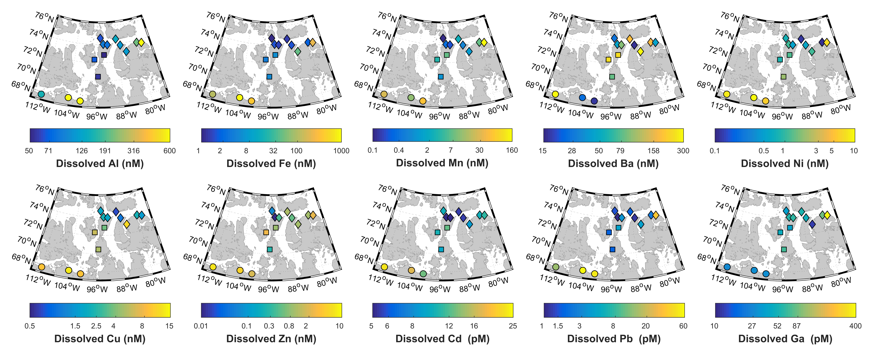

__Abstract__: Trace metals are essential micronutrients for phytoplankton, as well as useful tracers of biogeochemical processes in aquatic systems. The largest Arctic rivers are known to play an important role in the cycling of trace metals in the Arctic Ocean; however, these systems account for little more than half of Arctic freshwater discharge, leaving a major gap in our understanding of the trace metal geochemistry from smaller river systems. This is especially problematic for rivers draining the Arctic coastal margins, as these continuous permafrost systems are anticipated to be particularly sensitive to climate change. This study presents the first observations of dissolved and particulate trace metal concentrations and lead isotopes in 14 rivers in the Canadian Arctic Archipelago (CAA). Dissolved concentrations of aluminum, iron, manganese, nickel, copper, zinc, cadmium, and lead display clear spatial variability in their distributions. Small rivers located in the central islands of the CAA have remarkably low concentrations of these trace metals, while the rivers draining the southern continental landmass have higher values. This geographic variability in dissolved metal concentrations reflects both differences in bedrock geology and the South-North environmental gradients in the Archipelago. We extrapolate these findings to estimate the dissolved trace metal concentrations for other rivers draining the CAA based on their geographic location. Elemental ratios measured in the suspended particulate matter in several rivers indicates a significant enrichment of nickel, copper, zinc, and lead over the crustal composition. In particular, lead isotope composition shows an extremely large range, varying from the highly radiogenic Tree River (206Pb/207Pb: 1.5121) in the south, to the relatively unradiogenic Glacier River (206Pb/207Pb: 1.0153) in the central CAA. Lack of correlation between the Pb isotopic composition and Pb enrichment, suggests Pb is derived from within the watershed. This work presents the first observations of dissolved and particulate trace metal concentrations in small coastal draining rivers from the CAA, an important first step in developing a baseline against which to evaluate future change in the high Arctic.
