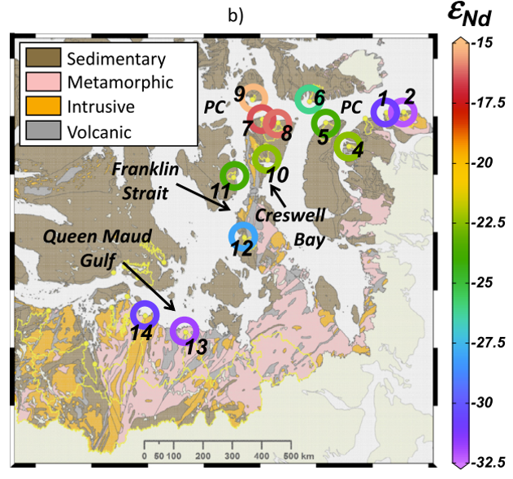

__Abstract__: Determining the factors controlling the neodymium (Nd) isotopic compositions (expressed as εNd) and rare earth element (REE) concentrations of rivers is imperative to improve our understanding of the distribution of these water mass tracers in the ocean. Here we present the first measurements of <0.45 μm-filtrate REE concentrations (i.e., the concentration of truly dissolved, nano-particulate and colloidal REEs passing through a 0.45 μm filter, hereafter referred to as dissolved) and εNd in rivers draining into the Canadian Arctic Archipelago (CAA). Results show a large variation in both REE concentrations (Nd=[8;37,260] pmol/kg) and εNd ([−32.1;−15.1]) in the thirteen rivers sampled. Dissolved REE concentrations increase with increasing fractions of metamorphic rocks and ice cover in the rivers' watersheds, while εNd and PAAS-normalized REE patterns are inherited from the watershed's bedrock lithology. The four rivers draining watersheds composed of Precambrian metamorphic rocks exhibit the highest REE concentrations, the least radiogenic εNd, and shale-normalized patterns enriched in light REEs. The remaining nine rivers drain mainly or exclusively sedimentary bedrock and have lower REE concentrations, more radiogenic εNd and generally show heavy REE enrichment, with variable negative cerium (Ce) anomalies. The presence of ice sheets in the drainage area, and the ionic strength, pH, and dissolved organic carbon concentration of river water are the main factors determining riverine dissolved REE concentrations by controlling the formation and stabilization of colloids. We estimate a flow of dissolved Nd transported by Arctic rivers discharging into the CAA equivalent to the Nd flux of seawater entering the CAA. Depending on the percentage of Nd removal during mixing with seawater, the impact of river water on the εNd of seawater exiting the CAA could be modest (if 90% removal) or more significant (if ≪90% removal). This riverine contribution could potentially impart a climate-sensitive εNd signature to the seawater reaching Baffin Bay, with possible implications for the use of εNd in paleoceanographic reconstructions of water mass distribution.
