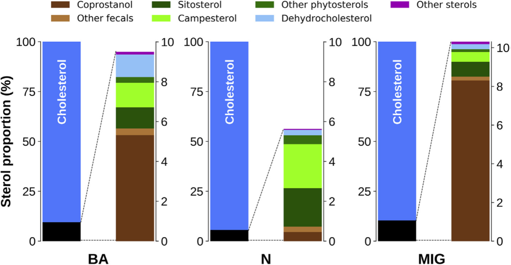

__Abstract__: In order to assess the impact of sewage pollution on the diet of the strict detritivorous and migratory South American fish, Prochilodus lineatus, 16 sterol biomarkers were analyzed by gas chromatography-mass spectrometry from fish muscle (n: 144) collected along 1200 km in the Rio de la Plata basin. Sterol concentrations were fairly homogeneous (2.4 ± 1.3 mg g−1 dry weight), but their proportion in lipids was highly variable and inversely related to both body mass and lipid contents, reflecting the more conservative character of sterols compared to the rapid accumulation of fat as fish grows. As expected, the muscle sterol signature was widely dominated by cholesterol (92 ± 4.5% of total sterols), but it exhibited a remarkable diversity with variable proportions of fecal coprostanol (4.0 ± 4.4%) and plant sterols (3.1 ± 1.9%, e.g. sitosterol and campesterol). Muscle sterols exhibited contrasting geographical differences associated with dietary shifts from plant-derived detritus in the northern reaches of the basin (N: Paraná and Uruguay Rivers), to sewage dominated inputs at Buenos Aires (BA). Fish from BA are fattier (lipids: 35 ± 18 vs. 15 ± 9.0% at N), with higher total sterol contents (2.6 ± 1.3 vs. 1.9 ± 1.0 mg g−1), abundant coprostanol (5.3 ± 4.4 vs. 0.46 ± 1.1%) and lower plant sterols (2.6 ± 1.6 vs 4.6 ± 2.0%), reflecting a diet shifted to anthropogenic organic matter as opposed to vegetal detritus in the north. Accordingly, BA fish presented lower phyto/fecal sterol ratios (0.37 ± 0.21 vs. 0.91 ± 0.12 at N) and higher copro/epicoprostanol ratios (0.95 ± 0.082 vs 0.51 ± 0.25 at N), indicating fresh fecal inputs which provide a valuable supply of easily absorbed organic matter at this site. In addition, the sterol signature allowed to distinguish migratory fish from BA collected 900 km north (previously identified by their pollutant fingerprint and biochemical composition). In fact, coprostanol concentrations show a direct relationship with human populations along the basin, highlighting the usefulness of fecal sterol biomarkers as tracers of polluted fish stocks.
