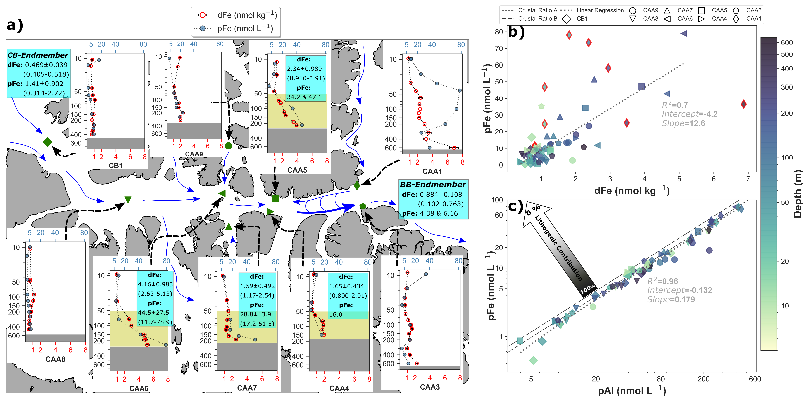

__Abstract__: Continental shelves are important sources of iron (Fe) in the land-dominated Arctic Ocean. To understand the export of Fe from the Arctic to Baffin Bay (BB) and the North Atlantic, we studied the alteration of the Fe signature in waters transiting the Canadian Arctic Archipelago (CAA). During its transit through the CAA, inflowing Arctic Waters from the Canada Basin become enriched in Fe as result of strong sediment resuspension and enhanced sediment-water interactions (non-reductive dissolution). These high Fe waters are exported to BB, where approximately 10.7 kt of Fe are delivered yearly from Lancaster Sound. Furthermore, if the two remaining main CAA pathways (Jones Sound and Nares Strait) are included, this shelf environment would be a dominant source term of Fe (dFe + pFe: 26–90 kt y−1) to Baffin Bay. The conservative Fe flux estimate (26 kt y−1) is 1.7–38 times greater than atmospheric inputs, and may be crucial in supporting primary production and nitrogen fixation in BB and beyond.
