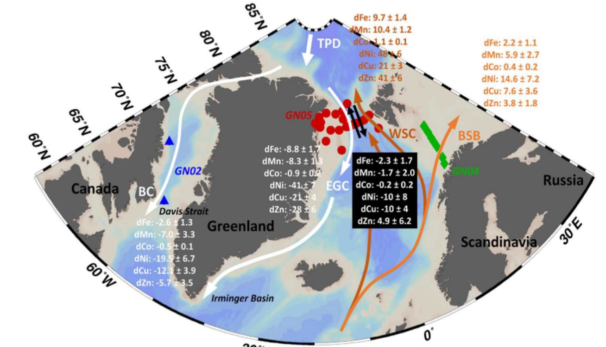

__Abstract__: The Arctic Ocean is considered a source of micronutrients to the Nordic Seas and the North Atlantic Ocean through the gateway of Fram Strait (FS). However, there is a paucity of trace element data from across the Arctic Ocean gateways, and so it remains unclear how Arctic and North Atlantic exchange shapes micronutrient availability in the two ocean basins. In 2015 and 2016, GEOTRACES cruises sampled the Barents Sea Opening (GN04, 2015) and FS (GN05, 2016) for dissolved iron (dFe), manganese (dMn), cobalt (dCo), nickel (dNi), copper (dCu) and zinc (dZn). Together with the most recent synopsis of Arctic-Atlantic volume fluxes, the observed trace element distributions suggest that FS is the most important gateway for Arctic-Atlantic dissolved micronutrient exchange as a consequence of Intermediate and Deep Water transport. Combining fluxes from FS and the Barents Sea Opening with estimates for Davis Strait (GN02, 2015) suggests an annual net southward flux of 2.7 ± 2.4 Gg·a−1 dFe, 0.3 ± 0.3 Gg·a−1 dCo, 15.0 ± 12.5 Gg·a−1 dNi and 14.2 ± 6.9 Gg·a−1 dCu from the Arctic toward the North Atlantic Ocean. Arctic-Atlantic exchange of dMn and dZn were more balanced, with a net southbound flux of 2.8 ± 4.7 Gg·a−1 dMn and a net northbound flux of 3.0 ± 7.3 Gg·a−1 dZn. Our results suggest that ongoing changes to shelf inputs and sea ice dynamics in the Arctic, especially in Siberian shelf regions, affect micronutrient availability in FS and the high latitude North Atlantic Ocean.
