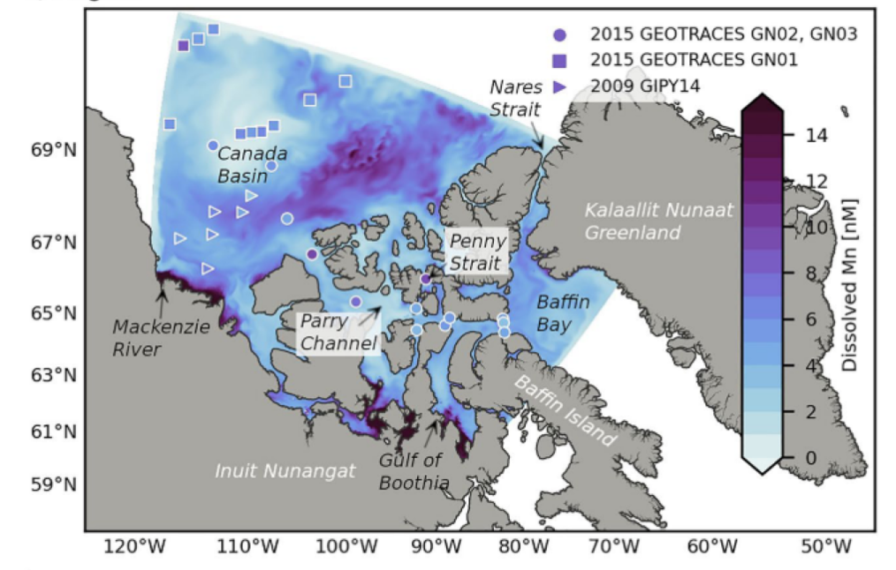

__Abstract__: Biogeochemical cycles in the Arctic Ocean are sensitive to the transport of materials from continental shelves into central basins by sea ice. However, it is difficult to assess the net effect of this supply mechanism due to the spatial heterogeneity of sea ice content. Manganese (Mn) is a micronutrient and tracer which integrates source fluctuations in space and time while retaining seasonal variability. The Arctic Ocean surface Mn maximum is attributed to freshwater, but studies struggle to distinguish sea ice and river contributions. Informed by observations from 2009 IPY and 2015 Canadian GEOTRACES cruises, we developed a three-dimensional dissolved Mn model within a 1/12° coupled ocean-ice model centered on the Canada Basin and the Canadian Arctic Archipelago (CAA). Simulations from 2002 to 2019 indicate that annually, 87%–93% of Mn contributed to the Canada Basin upper ocean is released by sea ice, while rivers, although locally significant, contribute only 2.2%–8.5%. Downstream, sea ice provides 34% of Mn transported from Parry Channel into Baffin Bay. While rivers are often considered the main source of Mn, our findings suggest that in the Canada Basin they are less important than sea ice. However, within the shelf-dominated CAA, both rivers and sediment resuspension are important. Climate-induced disruption of the transpolar drift may reduce the Canada Basin Mn maximum and supply downstream. Other micronutrients found in sediments, such as Fe, may be similarly affected. These results highlight the vulnerability of the biogeochemical supply mechanisms in the Arctic Ocean and the subpolar seas to climatic changes.
