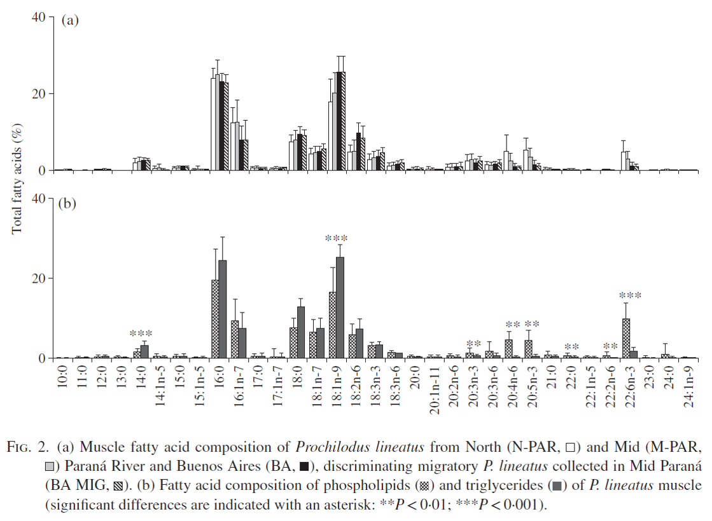

__Abstract__: Muscle fatty acid profiles and PCB contents of the detritivorous species Prochilodus lineatus and its diet (stomach contents, settling particles and sediments) were analysed from reference and polluted areas of the Paraná-Rio de la Plata basin, to evaluate the alterations produced by opportunistic feeding on sewage discharges. Overall muscle fatty acid composition was dominated by saturated and monounsaturated 16 and 18 carbon (18 C-FA) components with reduced long-chain polyunsaturated fatty acids (LC-PUFA). Compared to sediments, settling particles and stomach contents were enriched in lipids and had a similar fatty acid composition. Opportunistic feeding on sewage detritus at Buenos Aires resulted in enhanced PCB and triglyceride accumulation, with higher proportions of 18 C-FA and lower proportions of 16:1 and LC-PUFA compared to fish from northern pristine reaches of the basin. Mid-Paraná showed intermediate values reflecting mixing of the North stock with migrating Buenos Aires P. lineatus identified by their lipid and contaminant profile. According to multivariate analyses, this geographical variation of fatty acid composition was strongly influenced by PCB concentration. Prochilodus lineatus assimilates the energy subsidy of sewage inputs through enhanced lipogenesis with dominant 18 C-FA and significant amounts of valuable LC-PUFA. This lipid alteration facilitates the bioaccumulation of PCBs which in turn may reinforce the adipogenic effect of sewage feeding.
