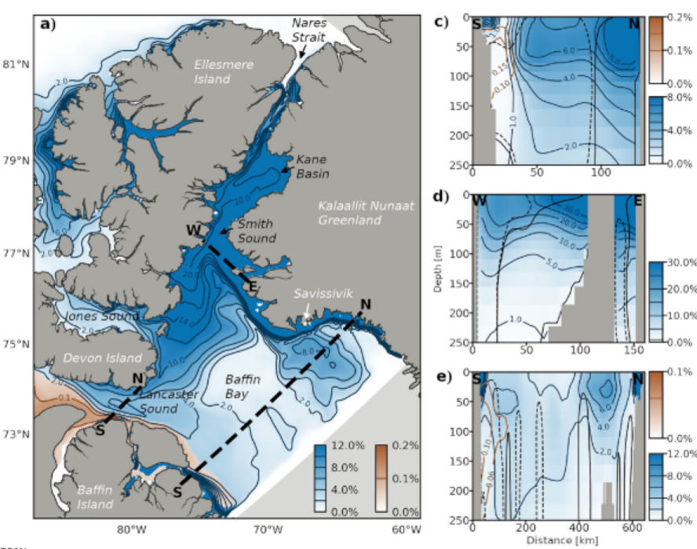

__Abstract__: Rising temperatures and an acceleration of the hydrological cycle due to climate change are increasing river discharge, causing permafrost thaw, glacial melt, and a shift to a groundwater-dominated system in the Arctic. These changes are funneled to coastal regions of the Arctic Ocean where the implications for the distributions of nutrients and biogeochemical constituents are unclear. In this study, we investigate the impact of terrestrial runoff on marine biogeochemistry in Inuit Nunangat (the Canadian Arctic Archipelago)—a key pathway for transport and modification of waters from the Arctic Ocean to the North Atlantic—using sensitivity experiments from 2002 to 2020 with an ocean model of manganese (Mn). The micronutrient Mn traces terrestrial runoff and the modification of geochemical constituents of runoff during transit. The heterogeneity in Arctic runoff composition creates distinct terrestrial fingerprints of influence in the ocean: continental runoff influences Mn in the southwestern Archipelago, glacial runoff dominates the northeast, and their influence co-occurs in central Parry Channel. Glacial runoff carries micronutrients southward from Nares Strait in the late summer and may help support longer phytoplankton blooms in the Pikialasorsuaq polynya. Enhanced glacial runoff may increase micronutrients delivered downstream to Baffin Bay, accounting for up to 18% of dissolved Mn fluxes seasonally and 6% annually. These findings highlight how climate induced changes to terrestrial runoff may impact the geochemical composition of the marine environment, and will help to predict the extent of these impacts from ongoing alterations of the Arctic hydrological cycle.
