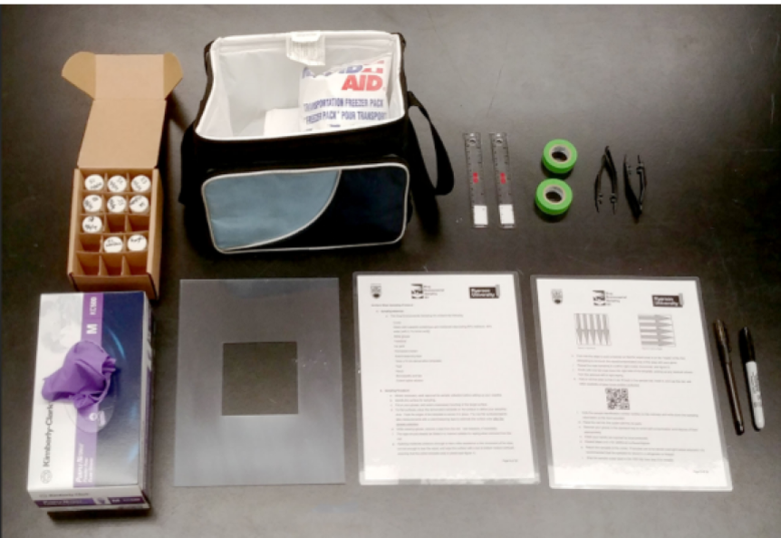

__Abstract__: Contamination of multiple antineoplastic drugs (ADs) on work surfaces presents an exposure concern for health care workers. Surface wipe sampling is a recognized method to evaluate the degree of contamination present. Our research team has previously reported on wipe sampling and analytical methods to simultaneously detect 10 commonly used ADs from a single wipe. Our objectives here were: to field test a protocol consisting of the wipe sampling method and an accompanying wipe sample collection tool kit and confirm this protocol can be effectively used by health care workers to assess drug contamination levels in their facilities; and, to confirm the potential for simultaneous exposure to multiple antineoplastic drugs. Three facilities within one health authority in British Columbia, Canada participated in this field study. In collaboration with the site health and safety advisors, up to 25 surfaces within each facility were considered for sampling. Collected wipe samples were analyzed using HPLC-MS/MS to quantify the 10 analyte, resulting in 750 potential analyses. Following the sampling, each of the three facilities’ safety advisors provided feedback regarding the usability of the protocols. Among the 72 wipe samples actually collected (or 720 analyses conducted), detectable levels and simultaneous contamination of work surfaces of five of the 10 analytes were found at all three participating sites: 5-fluorouracil, cyclophosphamide, vincristine, paclitaxel, and methotrexate; (range < LoD to 33.0 ng/cm2) with 5-fluorouracil having the highest concentration in every instance. Drug contamination was found on a variety of different work surfaces in pharmacies and patient care areas among all three sites. Users of the sampling protocols were generally satisfied with the wipe sample collection toolkit with some minor suggestions for improvement. Our findings support the hypothesis that health care workers may be simultaneously at risk of exposure to several ADs. Our toolkit was found to be user-friendly and manageable by those who were not experienced in collecting wipe samples to monitor contamination of ADs on the work surfaces in their facilities.
