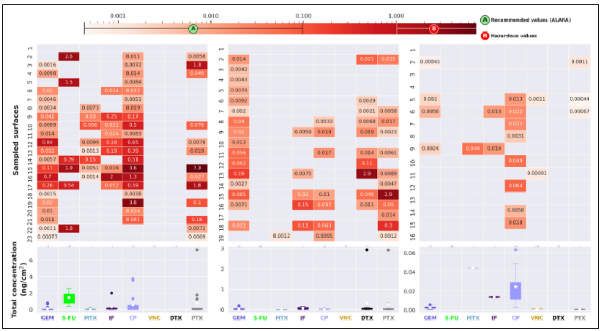

__Abstract__: Introduction: Antineoplastic drug contamination can result in severe health effects for healthcare workers exposed to them. Despite the worldwide growing concern regarding these drugs and sustained monitoring efforts in developed countries, there is almost no data about surface contamination levels in Argentina, in particular, and South America, in general. Methods: Antineoplastic drug contamination was measured in three Argentinean public hospitals (pharmacy and daycare center areas) by surface wiping and liquid chromatography coupled with tandem mass spectrometry. Results and Discussion: Eleven drugs were detected, in 51 of 58 sampled surfaces, in variable concentrations from 0.00064 to 7.3 ng cm−2, with cyclophosphamide, gemcitabine, and paclitaxel as the most prevalent drugs. This highly variable antineoplastic distribution reflects differences in facility layout, number of patients, antineoplastic drug use, etc., at each hospital. Values exceeding the 1 ng cm−2 threshold were detected in 13 surfaces of the two hospitals handling the largest amounts of antineoplastic drugs. The cyclophosphamide 75th percentile averaged 0.030 ng cm−2 comparable to the high values reported more than 10 years ago for developed countries, emphasizing the potential of reducing antineoplastic contamination by implementing routine monitoring and improved cleaning and handling procedures. Conclusion: This study is the first survey of multi-compound surface antineoplastic contamination in Argentinean (and South American) hospitals, providing a baseline against which future studies can be compared. Widespread antineoplastic contamination has been detected on numerous surfaces, with concentrations surpassing suggested threshold exposure levels (1 ng cm−1) for some surfaces in two of the sampled hospitals.
