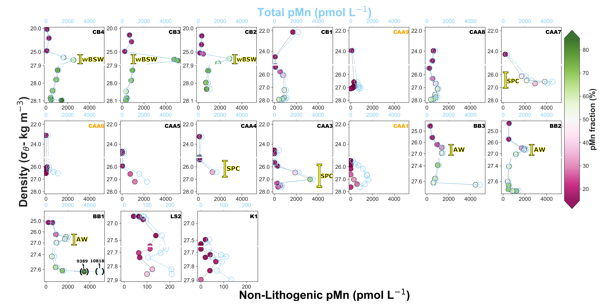

**Abstract**: Particulate Mn, given its high adsorptive capacity and oxidation potential, has profound impacts on the cycling of various trace elements and organic matter in the ocean. Moreover, particulate Mn acts as a sink (via oxidation and adsorption) or as a source (via remineralization and photoreduction) term of bioactive dissolved Mn(II). In the Canadian Arctic Ocean, particulate Mn distributions in the water column revealed the presence of distinctively high particulate Mn concentrations and an overwhelming dominance of the non-lithogenic component to the bulk particulate Mn pool. This phenomenon is of particular importance in halocline waters in the Canada Basin, the Canadian Arctic Archipelago and Baffin Bay, and near-bottom samples in Baffin Bay. Enhanced microbially-mediated Mn oxidation in the water column is suggested as the main mechanism driving the non-lithogenic dominance. Indeed, the microbial community composition data associated with high non-lithogenic particulate Mn (i.e., Mn oxides) display a high relative abundance of taxa (e.g., f.Pirellulaceae, o.Phycisphaerales, f.Cryomorphaceae, g. Moritella) that have been identified in Mn oxide enriched environments. Furthermore, numerous taxa identified in the Canada Basin halocline water, where non-lithogenic particulate Mn peaked, are phylogenetically related to known (cultured) Mn-oxidizing bacteria (MnOB; e.g., Rhodobacteraceae, Oceanospirillaceae, Rhizobiaceae, and other Alphaproteobacteria). Putative MnOB appears to proliferate in certain water masses having a unique set of environmental conditions: low light intensity—alleviating photoinhibition—and high dissolved Mn concentrations, the main drivers known to influence MnOB dynamic, and hence, Mn oxidation.
