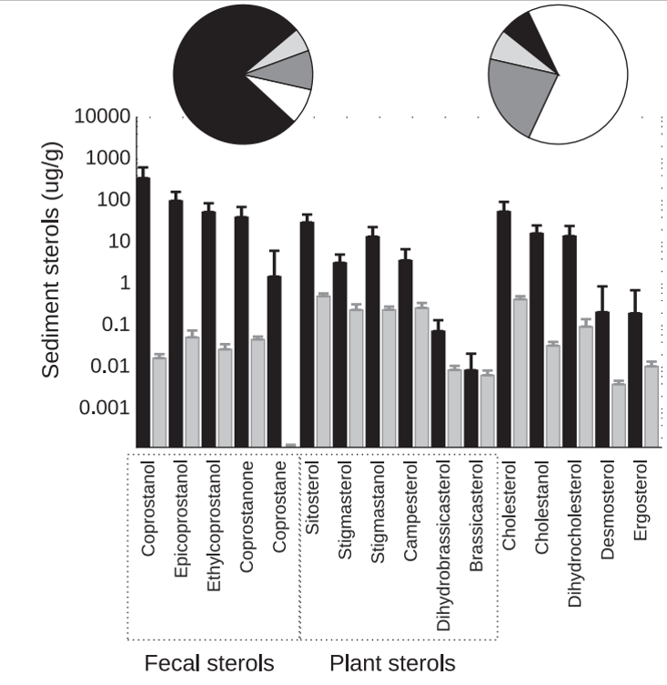

__Abstract__: Sources and diagenetic alterations of sterol markers were studied in settling material and sediments near the Buenos Aires main sewer (BA), and at a relatively non-polluted northern site at the Uruguay River (N). Vertical particle fluxes were 7-times higher at BA relative to N (34 ± 24 vs 4.6 ± 3.6 mg/cm2/day; mean ± standard deviation), increasing during rainy months. Total sterol contents were consistently higher at BA, both in settling material (7140 ± 7905 vs 41 ± 47 μg/g at N) and sediments (708 ± 454 vs 1.9 ± 0.18 μg/g). This difference was further amplified in the vertical flux of sterols (116 ± 168 vs 0.070 ± 0.13 mg/cm2/year). At BA, sterol composition of settling material and sediments was dominated by fecal sterols (75–77%), with extreme coprostanol concentrations (3.6 ± 4.8 vs 0.35 ± 0.28 mg/g at N) which are similar to sewage sludge. In contrast, at N the sterol profile was dominated by plant sterols (57–64%), mainly sitosterol, stigmasterol and campesterol. At BA the discharge of fresh sewage was confirmed by the high coprostanol/(coprostanol + epicoprostanol) ratio. At N, the overwhelming dominance of plant sterols over herbivore fecal sterols was reflected by the high sitosterol/(sitosterol + 24-ethylcoprostanol) ratio and the low coprostanol/(coprostanol + 24-ethylcoprostanol) ratio. The coprostanol/(coprostanol + epicoprostanol) and cholesterol/(cholesterol + cholestanol) ratios were lower in sediments than in settling material, reflecting the sterol degradation at the sediment surface. The accumulation efficiencies, calculated as the difference between trap fluxes and sediment inventories, were 2–7 times higher at BA reflecting strong vertical fluxes and enhanced preservation under anoxic conditions. During diagenetic processes, epicoprostanol (partially produced in situ), cholestanol and plant sterols were the best-preserved sterols, while cholesterol was the most labile during burial.
