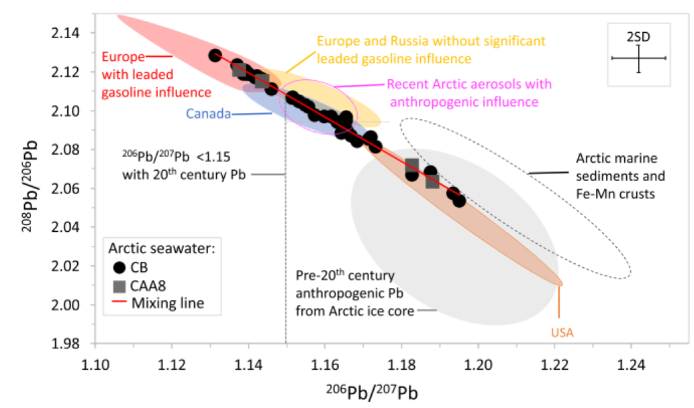

__Abstract__: Anthropogenic Pb is widespread in the environment including remote places. However, its presence in Canadian Arctic seawater is thought to be negligible based on low dissolved Pb (dPb) concentrations and proxy data. Here, we measured dPb isotopes in Arctic seawater with very low dPb concentrations (average ∼5 pmol ⋅ kg−1) and show that anthropogenic Pb is pervasive and often dominant in the western Arctic Ocean. Pb isotopes further reveal that historic aerosol Pb from Europe and Russia (Eurasia) deposited to the Arctic during the 20th century, and subsequently remobilized, is a significant source of dPb, particularly in water layers with relatively higher dPb concentrations (up to 16 pmol ⋅ kg−1). The 20th century Eurasian Pb is present predominantly in the upper 1,000 m near the shelf but is also detected in older deep water (2,000 to 2,500 m). These findings highlight the importance of the remobilization of anthropogenic Pb associated with previously deposited aerosols, especially those that were emitted during the peak of Pb emissions in the 20th century. This remobilization might be further enhanced because of accelerated melting of permafrost and ice along with increased coastal erosion in the Arctic. Additionally, the detection of 20th century Eurasian Pb in deep water helps constrain ventilation ages. Overall, this study shows that Pb isotopes in Arctic seawater are useful as a gauge of changing particulate and contaminant sources, such as those resulting from increased remobilization (e.g., coastal erosion) and potentially also those associated with increased human activities (e.g., mining and shipping).
