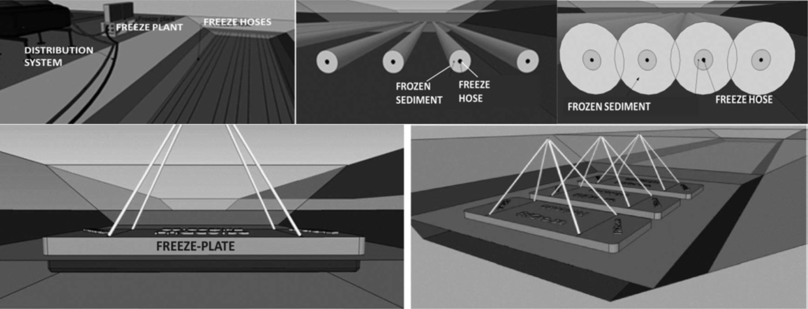

__Abstract__: Submerged tar-contaminated sediment are generally very loose, which makes remediation challenging. We tested if a modified version of freeze-dredging could be used to remove and dewater such sediment in a canal down-stream a coking plant. PVC hoses carrying a heat medium were placed horizontally in the submerged sediment. Five days of freezing allowed straightforward removal of most of the sediment. Flat freeze cells were placed side by side in the canal to remove the rest. The freeze-thaw process increased the dry substance content from approximately 50 to 80%. Outdoors storage under rainy conditions did not re-wet the dried sediment. The material was successfully used as feed-stock in the coking plant, with the double cost-benefit of avoided transportation to deposit and reduced use of coal. The study demonstrates that freeze-dredging can facilitate removal, storage and beneficial re-use of submerged tar-contaminated sediment.
